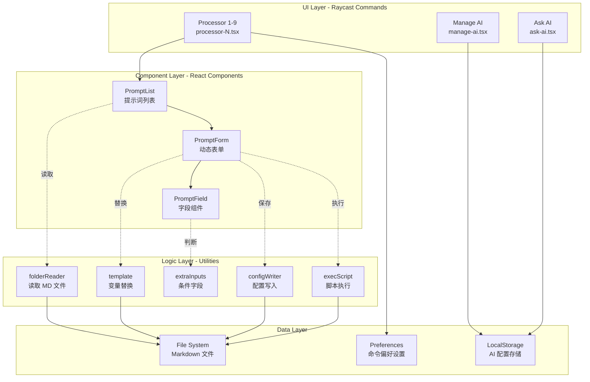
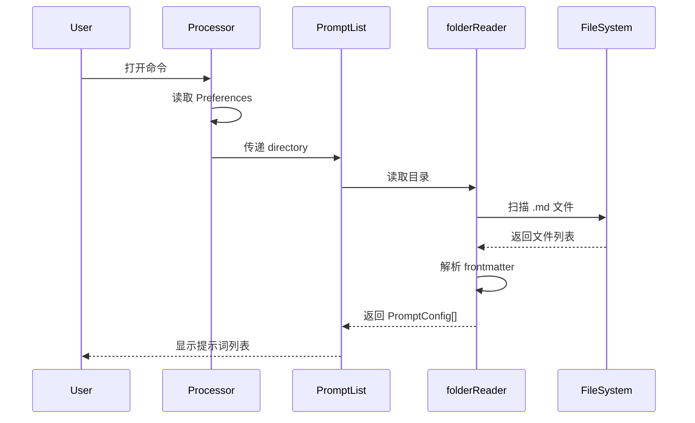
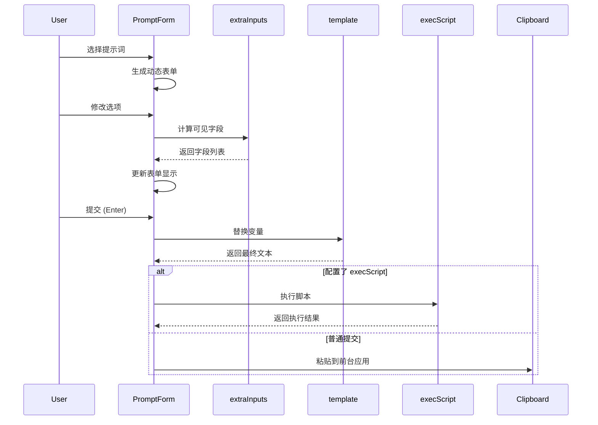
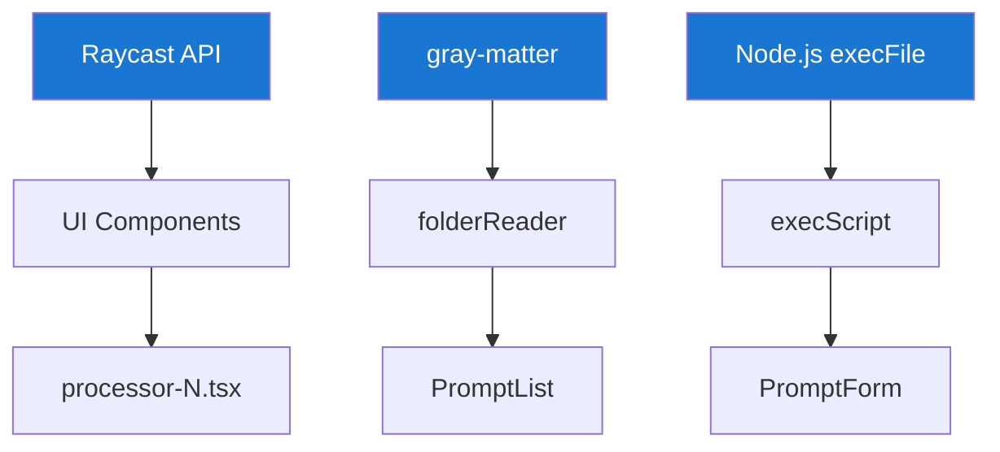

# Aurora Input Processor - 核心架构

## 系统概述

Aurora Input Processor 是一个基于 Raycast 的提示词管理插件，支持多目录、动态表单、变量替换和脚本执行等功能。

### 核心特性

- **多 Processor 支持**：最多支持 9 个独立的提示词目录管理器
- **声明式配置**：使用 Markdown + YAML frontmatter 定义提示词
- **动态表单生成**：根据配置自动生成输入表单
- **智能变量替换**：支持 `{{variable}}` 模板语法
- **条件字段显示**：基于选项动态显示额外输入字段
- **脚本执行**：将表单数据转为环境变量执行外部脚本

## 架构层次



## 数据流

### 1. 提示词加载流程



### 2. 表单提交流程



## 核心组件

### UI 层

| 组件 | 职责 | 关键特性 |
|------|------|---------|
| **processor-N.tsx** | Processor 命令入口 | 从 Preferences 读取配置，渲染 PromptList |
| **manage-ai.tsx** | AI 提供商管理 | 管理 AI 服务配置，存储到 LocalStorage |
| **ask-ai.tsx** | AI 问答界面 | 快速调用 AI 服务 |

### Component 层

| 组件 | 职责 | 输入 | 输出 |
|------|------|------|------|
| **PromptList** | 提示词列表展示 | ProcessorConfig | Action: Push PromptForm |
| **PromptForm** | 动态表单渲染 | PromptConfig | 提交处理：粘贴/复制/执行 |
| **PromptField** | 单个字段渲染 | PromptInput | Form Field Component |

### Logic 层

| 模块 | 职责 | 核心函数 |
|------|------|---------|
| **folderReader** | 读取 Markdown 文件 | `readPromptsFromFolder()` |
| **template** | 变量替换引擎 | `replaceVariables()` |
| **extraInputs** | 条件字段逻辑 | `getVisibleInputIds()` |
| **execScript** | 脚本执行器 | `executeScript()` |
| **configWriter** | 配置写入 | `saveConfig()` |

### Data 层

```mermaid
graph LR
    subgraph "提示词配置文件 (.md)"
        direction LR
        FM[YAML Frontmatter<br/>title + inputs]
        BODY[Markdown Body<br/>带 &#123;&#123;variable&#125;&#125; 模板]
    end
    
    subgraph "Preferences"
        NAME[name: 显示名称]
        DIR[directory: 目录路径]
    end
    
    subgraph "LocalStorage"
        AI[AI Providers<br/>服务商配置]
    end
    
    FM --> BODY
```



## 关键技术点

### 1. 提示词配置格式

```yaml
---
title: 示例提示词
inputs:
  - id: name
    type: text
    label: 姓名
    required: true
  - id: role
    type: select
    label: 角色
    options:
      - label: 开发者
        value: dev
        extraInputs: [language]
      - label: 设计师
        value: designer
  - id: language
    type: text
    label: 编程语言
    isExtraInput: true
execScript: /path/to/script.sh
---

你好，{{name}}！你是一名{{role}}。
{{language}}
```

### 2. 条件字段机制

- 字段配置 `isExtraInput: true` 标记为条件字段
- 选项通过 `extraInputs: [id1, id2]` 关联字段
- `extraInputs.ts` 计算当前可见字段
- multiselect 类型合并多个选项的 extraInputs

### 3. 变量替换规则

| 类型 | 替换规则 |
|------|---------|
| text/textarea/select | 直接替换为值 |
| multiselect | 转为逗号分隔字符串 |
| checkbox | 转为 "是" 或 "否" |
| 隐藏的 extraInput | 替换为空字符串 |

### 4. 脚本执行机制


## 扩展性设计

- **Processor 数量**：可通过增加 `processor-N.tsx` 扩展（当前最多 9 个）
- **字段类型**：在 `PromptField.tsx` 中添加新类型支持
- **输出方式**：在 `PromptForm.tsx` 中添加新 Action
- **AI 服务**：在 `manage-ai.tsx` 中配置新提供商

## 依赖关系



### 核心依赖

- **@raycast/api**: Raycast 扩展 API（Form、List、Action 等）
- **@raycast/utils**: 工具函数库
- **gray-matter**: Markdown frontmatter 解析
- **React**: UI 组件框架
- **TypeScript**: 类型安全

## 总结

Aurora Input Processor 采用**分层架构**设计：

1. **UI 层**负责命令入口和用户交互
2. **Component 层**提供可复用的 React 组件
3. **Logic 层**封装核心业务逻辑
4. **Data 层**处理文件系统和配置存储

通过**声明式配置** + **动态渲染** + **模板引擎**的组合，实现了灵活强大的提示词管理系统。
